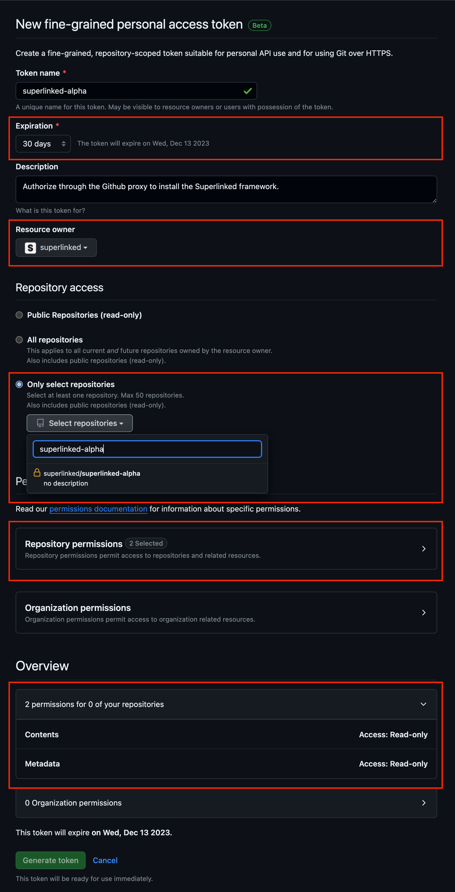

# Superlinked Alpha (v0.1.0)

Notebook examples to show the common use-cases of the Superlinked framework. We have created notebooks for you to be able to run the experiments right in your ennvironment with direct access to your data.

## Create a token

> You need to create a personal access token that is scoped to the superlinked-alpha project with the necessary permissions. 

1. Create a [new access token](https://github.com/settings/personal-access-tokens/new) on GitHub
1. Adjust the expiration date.
1. Select `superlinked` as the resource owner.
1. Select the `superlinked/superlinked-alpha` repository.
1. Provide read-only access on `Content` and `Metadata`.
1. Generate token.

## Usage

1. Import the [notebooks](./notebook/) in your preferred notebook environment.
1. Replace `YOUR_GITHUB_TOKEN` at the beginning of the notebook with your token to install the Superlinked framework.
1. Start experimenting.

## Issue tracking

If you encounter any challanges during your experiment feel free to create an issue [here](https://github.com/superlinked/superlinked/issues/new).