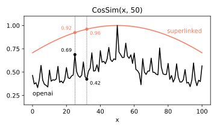
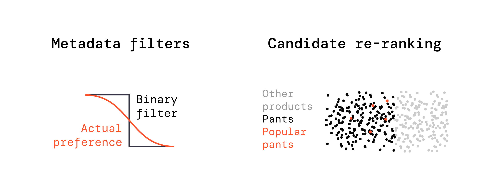

## Your users expect better search

The landscape of search and information retrieval is rapidly evolving. With the rise of AI and large language models, user expectations for search capabilities have skyrocketed. Your users now expect that your search can handle complex, nuanced queries that go beyond simple keyword matching. Just hear what Algolia CTO has to say -

> "We saw 2x more keywords search 6 months after the ChatGPT launch."
> _Algolia CTO, 2023_

They have 17,000 customers accounting for 120B searches/month. This trend isn't isolated. Across industries, we're seeing a shift towards more sophisticated search queries that blend multiple concepts, contexts, and data types.

Vector Search with text-only embeddings (& also multi-modal) fails on complex queries, because complex queries are never just about text. They involve other data too!

Consider these examples:

1. **E-commerce**: A query like "comfortable running shoes for marathon training under $150" involves text, numerical data (price), and categorical information (product type, use case).
2. **Content platforms**: "Popular science fiction movies from the 80s with strong female leads" combines text analysis, temporal data, and popularity metrics.
3. **Job search**: "Entry-level data science positions in tech startups with good work-life balance" requires understanding of text, categorical data (industry, job level), and even subjective metrics.


## Enter Superlinked

This is where Superlinked comes in, offering a powerful, flexible framework designed to handle the complexities of modern search and information retrieval challenges. Superlinked is a vector embedding solution for AI teams working with complicated data within their [RAG](/use-cases/rag-hr), [Search](/use-cases/semantic-search-news), [Recommendations](/use-cases/recsys-ecomm) and [Analytics](/use-cases/analytics-keyword-expansion) stack.

Let's quickly go through an example. Keep in mind that there are a ton of new concepts thrown at you, but this is just to illustrate how Superlinked 'looks'. We'll go over each concept in detail in the [following sections](/getting-started/basic-building-blocks).

Imagine you are building a system that can deal with a query like `"recent news about crop yield"`. After collecting your data, you define your schema, ingest data and build index like this:

<Steps>
<Step title="Define your schemas">
  Create schema objects that define the structure of your data, including News, User, and Event entities.

  <Accordion title="Schema definition code">
    ```python
    class News(sl.Schema):
        id: sl.IdField
        created_at: sl.Timestamp
        like_count: sl.Integer
        moderation_score: sl.Float
        content: sl.String

    class User(sl.Schema):
        id: sl.IdField
        interest: sl.String

    class Event(sl.EventSchema):
        id: sl.IdField
        news: sl.SchemaReference[News]
        user: sl.SchemaReference[User]
        event_type: sl.String
    ```

  </Accordion>
</Step>

<Step title="Create embedding spaces">
  Define different types of embedding spaces that will capture various aspects of your data: recency, popularity, trust, and semantic similarity.

  <Accordion title="Encoder definition code">
    ```python
    recency_space = sl.RecencySpace(timestamp=news.created_at)
    popularity_space = sl.NumberSpace(number=news.like_count, mode=sl.Mode.MAXIMUM)
    trust_space = sl.NumberSpace(number=news.moderation_score, mode=sl.Mode.MAXIMUM)
    semantic_space = sl.TextSimilarity(
        text=[news.content, user.interest], model="sentence-transformers/all-mpnet-base-v2"
    )
    ```
  </Accordion>
</Step>

<Step title="Build your index">
  Combine all the embedding spaces into a single index and define effects that capture user behavior patterns.

  <Accordion title="Index definition code">
    ```python
    index = sl.Index(
        spaces=[recency_space, popularity_space, trust_space, semantic_space],
        effects=[sl.Effect(semantic_space, event.user, 0.8 * event.news)],
    )
    ```
  </Accordion>
</Step>

<Step title="Define parameterized queries">
  Create flexible queries that can be customized at runtime with different weights and parameters.

  <Accordion title="Query definition code">
    ```python
    query = (
        sl.Query(
            index,
            weights={
                recency_space: sl.Param("recency_weight"),
                popularity_space: sl.Param("popularity_weight"),
                trust_space: sl.Param("trust_weight"),
                semantic_space: sl.Param("semantic_weight"),
            },
        )
        .find(news)
        .similar(semantic_space.text, sl.Param("content_query"))
        .with_vector(user, sl.Param("user_id"))
        .select_all()
    )
    ```
  </Accordion>
</Step>

<Step title="Set up the execution environment">
  Configure your executor to run either in memory for development or with production vector databases.

  <Accordion title="Executor setup and API usage">
    ```python
    sl.RestExecutor(
        sources=[sl.RestSource(news), sl.RestSource(user)],
        index=[index],
        query=[query],
        vector_database = sl.InMemoryVectorDatabase()
        # vector_database = sl.MongoDBVectorDatabase(...),
        # vector_database = sl.RedisVectorDatabase(...),
        # vector_database = sl.QdrantVectorDatabase(...),
        # vector_database = sl.TopKVectorDatabase(...),
    )

    # SparkExecutor()   <-- Coming soon in Superlinked Cloud
    ```

    ```bash
    curl -X POST \
        'http://localhost:8000/api/v1/search/query' \
        --header 'Accept: */*' \
        --header 'Content-Type: application/json' \
        --data-raw '{
            "content_query": "crop yields",
            "semantic_weight": 0.5,
            "recency_weight": 0.9,
            "popularity_weight": 0.5,
            "trust_weight": 0.2,
        }'
    ```

  </Accordion>
</Step>

<Step title="Handle natural language queries">
  Enable users to query your system using natural language, which Superlinked automatically converts to structured parameters.

  <Accordion title="Natural language query examples">
    ```python
    # In a notebook like this:
    query = (
        sl.Query(...)
        .with_natural_query(Param("recent news about crop yield"))
    )
    ```

    ```bash
    # As an API call like this:
    curl -X POST \
        'http://localhost:8000/api/v1/search/query' \
        --header 'Accept: */*' \
        --header 'Content-Type: application/json' \
        --data-raw '{
            "natural_language_query": "recent news about crop yield"
        }'
    ```

  </Accordion>
</Step>
</Steps>

Discover the powerful capabilities Superlinked offers [here](../concepts/overview.md).

## But can't I put all my data in json, stringify it and embed using LLM?

Stringify and embed approach produces unpredictable results. For example (code below):

- Embed 0..100 with OpenAI API
- Calculate and plot the cosine similarity
- Observe the difference between expected and actual results

```python

from openai import OpenAI
import numpy as np
from sklearn.metrics.pairwise import cosine_similarity

response = OpenAI().embeddings.create(
    input=[str(i) for i in range(0, 101)],
    model="text-embedding-3-small",
)
embeddings = np.array([r.embedding for r in response.data])
scores = cosine_similarity(embeddings, embeddings)

```

<Frame caption="OpenAI embeddings result in noisy, non-monotonic cosine similarity scores. For example, CosSim(25, 50) equals to 0.69 when CosSim(32, 50) equals 0.42 meaning 25 is more similar to 50 than 32 which doesn't make sense. Superlinked number embeddings avoid such inconsistencies by design.">
  
</Frame>

## Okay, But can't I ...

### 1. Use different already existing storages per attribute, fire multiple searches and then reconcile results?

<Info>
Our naive approach (above) - storing and searching attribute vectors separately, then combining results - is limited in ability, subtlety, and efficiency when we need to retrieve objects with multiple simultaneous attributes. Moreover, multiple kNN searches take [more time than a single search with concatenated vectors](https://redis.io/blog/benchmarking-results-for-vector-databases/).

It's better to store all your attribute vectors in the same vector store and perform a single search, weighting your attributes at query time.

Read more here: [Multi-attribute search with vector embeddings](https://superlinked.com/vectorhub/articles/multi-attribute-semantic-search)

</Info>

### 2. Use Metadata filters or Candidate re-ranking

<Info>
When you convert a fuzzy preference like "recent", "risky" or "popular" into a filter, you model a sigmoid with a binary step function = not enough resolution.

Semantic ranking & ColBERT only use text, learn2rank models need ML Engineers.
Broad queries eg "popular pants" can't be handled by re-ranking at all, due to poor candidate recall.



</Info>

## Okay, seems like Superlinked proposes a nice approach, but

1. How can I build with it at scale?
   The [Superlinked Server](../run-in-production/overview.md) is a deployable component available as a [Python package on PyPI](https://pypi.org/project/superlinked-server/), designed to enhance the operation of Superlinked by providing a RESTful API for communicating with your application. This package streamlines the integration of Superlinked's sophisticated search functionalities into existing applications by offering REST endpoints and Vector Database connectivity. It enables developers to focus on leveraging Superlinked's capabilities without the burden of infrastructure management, from initial prototype to full-scale production.

## How does it fit in the big picture?


