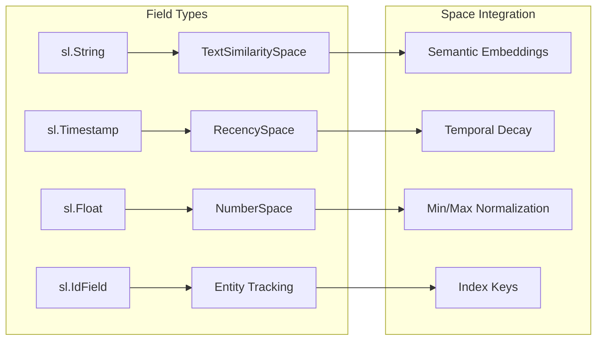
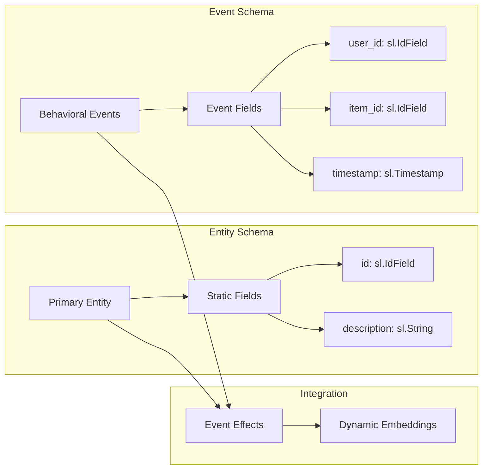

The Schema System provides typed data structure definitions that serve as contracts for data flowing through the Superlinked framework. Schemas define the structure, field types, and relationships of entities processed by spaces, indices, and queries, ensuring type safety and data integrity throughout the pipeline.

For information about how schemas integrate with vector embeddings, see [Space System](/reference/dsl/space/overview). For query definition and execution, see [Index and Query System](/reference/dsl/index/overview).

## Schema Type Reference

| Schema Type | Purpose | Definition Method | Key Fields |
|-------------|---------|-------------------|------------|
| `Schema` | Entity data structures | Class inheritance or decorator | `sl.String`, `sl.Float`, `sl.Timestamp`, `sl.IdField` |
| `EventSchema` | Behavioral data tracking | Class inheritance or decorator | Event-specific fields with timestamps |
| `IdSchemaObject` | Identifier management | Specialized schema objects | Unique entity identification |

## Schema Components Reference

<Tabs>
<Tab title="Core Components">
Foundation components for schema definition and management:

<CardGroup cols={2}>
  <Card 
    title="Schema" 
    icon="database" 
    href="/reference/common/schema/schema"
  >
    Core schema definition and management functionality
  </Card>
  <Card 
    title="Schema Object" 
    icon="cube" 
    href="/reference/common/schema/schema_object"
  >
    Individual schema object definitions and properties
  </Card>
  <Card 
    title="Event Schema" 
    icon="calendar-clock" 
    href="/reference/common/schema/event_schema"
  >
    Specialized schemas for event-based data structures
  </Card>
  <Card 
    title="Event Schema Object" 
    icon="calendar-days" 
    href="/reference/common/schema/event_schema_object"
  >
    Event-specific schema object definitions
  </Card>
</CardGroup>
</Tab>

<Tab title="Schema Objects">
Specialized schema objects for advanced functionality:

<CardGroup cols={1}>
  <Card 
    title="ID Schema Object" 
    icon="fingerprint" 
    href="/reference/common/schema/id_schema_object"
  >
    Specialized schema objects for identifier management
  </Card>
</CardGroup>
</Tab>
</Tabs>

## Schema Implementation Guide

<AccordionGroup>
<Accordion title="Schema Definition Methods">

Schemas can be defined using either class inheritance or the decorator pattern, providing flexibility in code organization and style preferences.

### Class-based Definition

```python
import superlinked as sl

class ParagraphSchema(sl.Schema):
    body: sl.String
    created_at: sl.Timestamp
    usefulness: sl.Float
    id: sl.IdField
```

### Decorator-based Definition

```python
@sl.schema
class ParagraphSchema:
    body: sl.String
    created_at: sl.Timestamp
    usefulness: sl.Float
    id: sl.IdField
```

</Accordion>

<Accordion title="Field Types and Usage">

The schema system supports several built-in field types for different data categories, each optimized for specific data characteristics and space integration.

### Field Type Implementation



### Field Type Usage Examples

| Field Type | Purpose | Usage Example |
|------------|---------|---------------|
| `sl.String` | Text data and categorical values | `description: sl.String` |
| `sl.Timestamp` | Temporal data and dates | `created_at: sl.Timestamp` |
| `sl.Float` | Floating-point numerical values | `price: sl.Float` |
| `sl.IdField` | Unique entity identifiers | `id: sl.IdField` |

```python
# Schema with comprehensive field types
@sl.schema
class ProductSchema:
    description: sl.String     # For TextSimilaritySpace
    price: sl.Float           # For NumberSpace
    category: sl.String       # For CategoricalSimilaritySpace
    created_at: sl.Timestamp  # For RecencySpace
    id: sl.IdField           # For entity identification

product = ProductSchema()

# Field access in spaces
text_space = sl.TextSimilaritySpace(
    text=product.description,
    model="sentence-transformers/all-mpnet-base-v2"
)

number_space = sl.NumberSpace(
    number=product.price,
    min_value=0.0,
    max_value=1000.0
)

recency_space = sl.RecencySpace(
    timestamp=product.created_at,
    period_time_list=[
        sl.PeriodTime(timedelta(days=1)),
        sl.PeriodTime(timedelta(days=7)),
        sl.PeriodTime(timedelta(days=30))
    ]
)
```
</Accordion>

<Accordion title="Schema Instantiation and Pipeline Integration">

Schemas are instantiated to create pipeline objects that reference specific data entities and their fields, enabling type-safe data processing throughout the framework.

### Pipeline Integration Flow


```python
# Schema instantiation
paragraph = ParagraphSchema()

# Field access in spaces
text_space = sl.TextSimilaritySpace(
    text=paragraph.body, 
    model="sentence-transformers/all-mpnet-base-v2"
)

# Field access in data parsing
parser = sl.DataFrameParser(
    paragraph, 
    mapping={
        paragraph.id: "index", 
        paragraph.created_at: "creation_date",
        paragraph.body: "text_content"
    }
)

# Index creation with multiple spaces
index = sl.Index([text_space, recency_space])

# Application setup
app = sl.InMemoryApp(
    vector_database=sl.InMemoryVectorDatabase(),
    indices=[index],
    sources=[sl.InMemorySource(paragraph, parser=parser)]
)
```
</Accordion>

<Accordion title="Data Parsing and Mapping">

Schemas integrate with data sources through parsing mechanisms that map external data formats to schema fields, ensuring consistent data flow and type safety.

### DataFrame Integration

```python
# Map DataFrame columns to schema fields
paragraph_parser = sl.DataFrameParser(
    paragraph, 
    mapping={
        paragraph.id: "index",
        paragraph.created_at: "creation_date",
        paragraph.body: "text_content"
    }
)

# Source configuration
source = sl.InMemorySource(paragraph, parser=paragraph_parser)
```


### Advanced Mapping Patterns

```python
# Complex field mapping with transformations
parser = sl.DataFrameParser(
    product,
    mapping={
        product.id: "product_id",
        product.description: lambda row: f"{row['title']} - {row['summary']}",
        product.price: "price_usd",
        product.created_at: "timestamp"
    }
)

# JSON data parsing
json_parser = sl.JsonParser(
    product,
    mapping={
        product.id: "$.product.id",
        product.description: "$.product.details.description",
        product.price: "$.product.pricing.amount"
    }
)
```
</Accordion>

<Accordion title="Event Schemas and Behavioral Modeling">

Event schemas capture behavioral data and interactions that can modify entity embeddings over time through the Event Effects System, enabling dynamic and adaptive recommendations.

### Event Schema Definition

```python
# Entity schema for static data
@sl.schema
class ItemSchema:
    description: sl.String
    category: sl.String
    id: sl.IdField

# Event schema for behavioral data
@sl.schema  
class UserInteractionSchema:
    user_id: sl.IdField
    item_id: sl.IdField
    interaction_type: sl.String
    timestamp: sl.Timestamp
    rating: sl.Float

item = ItemSchema()
interaction = UserInteractionSchema()
```

### Event-Entity Integration Flow



### Event Effects Implementation

```python
# Event effect configuration
effect = sl.EventEffect(
    event_schema=interaction,
    affected_schema=item,
    event_object_id=interaction.item_id,
    affected_object_id=item.id
)

# Time-based decay for interactions
recent_interactions = sl.EventEffect(
    event_schema=interaction,
    affected_schema=item,
    event_object_id=interaction.item_id,
    affected_object_id=item.id,
    time_period_hours=24 * 7  # 7 days
)
```

For detailed information about event schemas and behavioral modeling, see [Event Schema documentation](/reference/common/schema/event_schema). For event effects implementation, see [Event Effects System](/reference/dsl/index/effect).
</Accordion>

<Accordion title="Type Safety and Validation">

The schema system provides compile-time and runtime type safety through Python type annotations and framework validation, ensuring data integrity and catching errors early in development.

### Type Checking Integration

```python
# Type-safe field access
class ProductSchema(sl.Schema):
    name: sl.String
    price: sl.Float
    id: sl.IdField

product = ProductSchema()
# product.name is recognized as sl.String by type checkers
# product.price is recognized as sl.Float by type checkers
```


### Validation Features

```python
# Automatic type validation
product = ProductSchema()

# Framework validates field types at runtime
try:
    product.price = "invalid_price"  # Raises validation error
except InvalidInputException as e:
    print(f"Type validation failed: {e}")

# IDE support for field access
product.name.  # IDE shows string methods
product.price.  # IDE shows float methods
```
</Accordion>
</AccordionGroup>

## Key Features

Schema components provide:

- **Type Safety**: Strong typing and validation for all data fields with Python type annotation integration
- **Flexibility**: Support for various data types and structures with both inheritance and decorator patterns
- **Event Handling**: Specialized schemas for time-based event data and behavioral analytics
- **Data Integration**: Seamless parsing and mapping from external data sources like DataFrames and JSON
- **Framework Integration**: Native support for spaces, indices, and query operations
- **Validation**: Automatic data validation and error handling at both compile-time and runtime

<Info>
Schema definitions serve as the foundation for all data processing operations in Superlinked. Properly defined schemas ensure optimal performance, data integrity, and type safety throughout the entire pipeline.
</Info>

## Schema System Concepts

Schemas handle:

1. **Data Structure Definition**: Establish the expected format and types of input data
2. **Type Validation**: Ensure incoming data meets defined requirements at runtime
3. **Field Mapping**: Map external data sources to internal schema representations
4. **Event Modeling**: Support behavioral data tracking and dynamic embedding updates
5. **Framework Integration**: Enable seamless interaction with spaces, indices, and queries
6. **Development Safety**: Provide IDE support, autocomplete, and compile-time error detection 