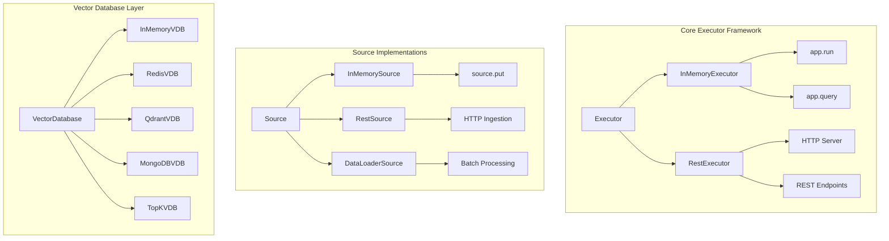

The Execution System provides the execution engine for processing queries and managing the computational workflow of Superlinked applications across different execution modes. Execution environments determine how your application processes data, handles queries, and manages vector storage during development, testing, and production phases.

For information about specific vector database integrations, see [Vector Databases](/reference/dsl/storage/overview). For production deployment configuration, see [Production Setup](/run-in-production/overview).

## Execution Environment Reference

| Environment | Primary Use Case | Data Persistence | Performance | Setup Complexity |
|-------------|------------------|------------------|-------------|------------------|
| In-Memory | Development, prototyping, testing | Temporary | Fast for small datasets | Minimal |
| Interactive | Jupyter notebooks, experimentation | Session-based | Moderate | Low |
| REST API | Production deployment | External VDB | High, scalable | High |

## Executor Components Reference

<Tabs>
<Tab title="Core Components">
Foundation components for execution engine management:

<CardGroup cols={2}>
  <Card 
    title="Executor" 
    icon="play" 
    href="/reference/dsl/executor/executor"
  >
    Base executor class and core execution functionality
  </Card>
  <Card 
    title="Exception" 
    icon="triangle-exclamation" 
    href="/reference/dsl/executor/exception"
  >
    Exception handling for executor operations
  </Card>
</CardGroup>
</Tab>

<Tab title="Execution Modes">
Choose the appropriate executor type for your deployment needs:

<CardGroup cols={2}>
  <Card 
    title="In Memory Executor" 
    icon="memory" 
    href="/reference/dsl/executor/in_memory/in_memory_executor"
  >
    Fast in-memory execution for development and testing
  </Card>
  <Card 
    title="Interactive Executor" 
    icon="terminal" 
    href="/reference/dsl/executor/interactive/interactive_executor"
  >
    Interactive execution for experimentation and prototyping
  </Card>
  <Card 
    title="Query Executor" 
    icon="magnifying-glass" 
    href="/reference/dsl/executor/query/query_executor"
  >
    Specialized query execution and processing
  </Card>
  <Card 
    title="REST Executor" 
    icon="globe" 
    href="/reference/dsl/executor/rest/rest_executor"
  >
    REST API-based execution for web services
  </Card>
</CardGroup>
</Tab>

<Tab title="REST Components">
Advanced REST execution capabilities:

<CardGroup cols={2}>
  <Card 
    title="REST Configuration" 
    icon="gear" 
    href="/reference/dsl/executor/rest/rest_configuration"
  >
    Configuration management for REST executors
  </Card>
  <Card 
    title="REST Descriptor" 
    icon="file-text" 
    href="/reference/dsl/executor/rest/rest_descriptor"
  >
    REST API descriptor and metadata management
  </Card>
  <Card 
    title="REST Handler" 
    icon="hand" 
    href="/reference/dsl/executor/rest/rest_handler"
  >
    Request handling and response processing for REST APIs
  </Card>
</CardGroup>
</Tab>
</Tabs>

## Execution Environment Architecture

```mermaid
flowchart TD
    subgraph DataFlow["Data Flow"]
        RD[Raw Data] --> SRC[Source]
        SRC --> PRSR[Parser]
        PRSR --> SCHM[Schema]
        SCHM --> SPC[Space Processing]
        SPC --> IDX[Index]
        IDX --> QE[Query Execution]
    end
    
    subgraph DevPhase["Development Phase"]
        DF[DataFrame/Dict] --> DFP[DataFrameParser]
        DFP --> IME[InMemoryExecutor]
        IME --> IMS[InMemorySource]
        IME --> IMV[InMemoryVDB]
        IMS --> AR[app.run]
        IMS --> AQ[app.query]
    end
    
    subgraph IntPhase["Interactive Phase"]
        JN[Jupyter Notebook] --> IME2[InMemoryExecutor]
        IQ[Interactive Queries] --> IME2
        IME2 --> IMS2[InMemorySource]
        IME2 --> IMV2[InMemoryVDB]
    end
    
    subgraph ProdPhase["Production Phase"]
        HC[HTTP Clients] --> RE[RestExecutor]
        DLS[DataLoaderSource] --> RE
        RE --> RS[RestSource]
        RE --> PVD[Production VDB]
        
        subgraph VDBOpts["VDB Options"]
            PVD --> RDB[RedisVDB]
            PVD --> QDB[QdrantVDB]
            PVD --> MDB[MongoDBVDB]
        end
    end
```



## Executor Class Hierarchy



## Implementation Guide

<AccordionGroup>
<Accordion title="Development Environment (InMemoryExecutor)">

The in-memory environment is ideal for initial prototyping, testing, and development workflows with fast iteration cycles.

### Use Cases
- Initial prototyping and experimentation
- Unit testing and validation
- Small dataset exploration
- Schema and space configuration development

### Key Characteristics
- Data stored in Python memory
- No external dependencies
- Fast iteration cycles
- Automatic cleanup on process termination

### Basic Setup

```python
import superlinked as sl

# Define schema
@sl.schema
class ParagraphSchema:
    body: sl.String
    created_at: sl.Timestamp
    id: sl.IdField

paragraph = ParagraphSchema()

# Create spaces and index
text_space = sl.TextSimilaritySpace(
    text=paragraph.body,
    model="sentence-transformers/all-mpnet-base-v2"
)

index = sl.Index([text_space])

# Setup data source
parser = sl.DataFrameParser(
    paragraph,
    mapping={
        paragraph.id: "index",
        paragraph.created_at: "creation_date", 
        paragraph.body: "text_content"
    }
)

source = sl.InMemorySource(paragraph, parser=parser)

# Create and run executor
executor = sl.InMemoryExecutor(
    sources=[source], 
    indices=[index]
)
app = executor.run()
```

### Context Data Support

```python
from datetime import datetime

EXECUTOR_DATA = {
    sl.CONTEXT_COMMON: {
        sl.CONTEXT_COMMON_NOW: datetime.now().timestamp()
    }
}

executor = sl.InMemoryExecutor(
    sources=[source], 
    indices=[index], 
    context_data=EXECUTOR_DATA
)
```

</Accordion>

<Accordion title="Interactive Environment">

Interactive execution extends in-memory capabilities specifically for Jupyter notebook workflows and data science experimentation.

### Enhanced Features
- Session persistence within notebook context
- Visualization integration with plotting libraries
- DataFrame conversion utilities
- Dynamic parameter adjustment

### Jupyter Integration

```python
# Interactive setup in notebooks
executor = sl.InMemoryExecutor(sources=[source], indices=[index])
app = executor.run()

# Query execution with immediate results
query = sl.Query(index)
result = app.query(query, query_text="search term")

# Convert to pandas for analysis
pandas_df = sl.PandasConverter.to_pandas(result)
display(pandas_df)
```

### Visualization Support

```python
import altair as alt

# Convert results for visualization
chart_data = sl.PandasConverter.to_pandas(result)

# Create interactive charts
chart = alt.Chart(chart_data).mark_circle().encode(
    x='similarity_score',
    y='relevance_rank',
    tooltip=['id', 'body']
)

chart.show()
```

</Accordion>

<Accordion title="Production Environment (RestExecutor)">

Production deployment requires persistent storage, scalability, and RESTful API interfaces for multi-client support.

### Production Requirements
- Persistent vector storage
- Horizontal scalability  
- High availability
- RESTful API interface
- Multi-client support

### Production Components
- External vector databases for persistence
- HTTP server for client communication
- Batch data ingestion capabilities
- Monitoring and telemetry integration

### REST Executor Setup

```python
# Production vector database configuration
vector_db = sl.RedisVectorDatabase(
    config=sl.RedisVectorDatabaseConfig(
        host="redis-cluster.production.com",
        port=6379,
        index_name="production_index"
    )
)

# REST source for HTTP ingestion
rest_source = sl.RestSource(paragraph)

# Production executor
executor = sl.RestExecutor(
    sources=[rest_source],
    indices=[index],
    vector_database=vector_db
)

# Start HTTP server
app = executor.run()
```

### Batch Data Loading

```python
# Data loader for bulk ingestion
data_loader_source = sl.DataLoaderSource(
    paragraph,
    parser=parser
)

# Batch processing configuration
executor = sl.RestExecutor(
    sources=[data_loader_source, rest_source],
    indices=[index],
    vector_database=vector_db
)
```

</Accordion>

<Accordion title="Data Sources by Environment">

Different execution environments support specific data source types optimized for their use cases.

### Source Type Support Matrix

| Source Type | Development | Interactive | Production |
|-------------|-------------|-------------|------------|
| `InMemorySource` | ✓ Primary | ✓ Primary | - |
| `RestSource` | - | - | ✓ Primary |
| `DataLoaderSource` | - | - | ✓ Batch |
| DataFrame input | ✓ | ✓ | - |
| Dictionary input | ✓ | ✓ | - |

### Development Sources

```python
# DataFrame input
df_source = sl.InMemorySource(schema, parser=df_parser)

# Dictionary input  
dict_data = [{"id": 1, "text": "example", "timestamp": "2024-01-01"}]
source.put(dict_data)
```

### Production Sources

```python
# REST ingestion endpoint
# POST /api/ingest with JSON payload

# Batch data loading
data_loader = sl.DataLoaderSource(schema, parser=batch_parser)
```

</Accordion>

<Accordion title="Query Execution Patterns">

Different environments support varying query patterns optimized for their execution context.

### Synchronous Queries (Development/Interactive)

```python
# Direct query execution
result = app.query(query, query_text="search term")
pandas_df = sl.PandasConverter.to_pandas(result)

# Parameter adjustment
query_with_params = query.with_weights(
    text_space=1.0,
    recency_space=0.5
)
```

### Asynchronous Queries (Production)

Production environments handle queries through HTTP endpoints:

- HTTP POST requests to REST endpoints
- JSON response format
- Concurrent query processing
- Load balancing support

```bash
# REST API query
curl -X POST http://api.production.com/query \
  -H "Content-Type: application/json" \
  -d '{"query_text": "search term", "limit": 10}'
```

### Context Data Management

All execution environments support context data for temporal operations:

```python
EXECUTOR_DATA = {
    sl.CONTEXT_COMMON: {
        sl.CONTEXT_COMMON_NOW: timestamp
    }
}

executor = sl.InMemoryExecutor(
    sources=[source], 
    indices=[index], 
    context_data=EXECUTOR_DATA
)
```

This enables:
- Recency space calculations
- Temporal filtering  
- Time-aware recommendations
- Event effect processing

</Accordion>
</AccordionGroup>

## Key Features

Executor components provide:

- **Multiple Execution Modes**: Support for various deployment and execution patterns from development to production
- **Performance Optimization**: Choose the right executor for your performance needs and scale requirements  
- **Scalability**: From local development to distributed production execution with horizontal scaling
- **API Integration**: Built-in REST API execution capabilities for web service deployment
- **Error Handling**: Robust exception management during execution with meaningful error responses
- **Context Management**: Temporal data support for recency calculations and time-aware processing

<Info>
Different executor types are optimized for specific execution scenarios. In-memory executors provide fast local execution for development, while REST executors enable scalable web service deployment with persistent storage.
</Info>

## Executor Selection Guide

Choose the right executor type for your use case:

- **In Memory Executor**: Best for development, testing, and high-performance local execution with small to medium datasets
- **Interactive Executor**: Ideal for experimentation, prototyping, and iterative development in Jupyter notebooks  
- **Query Executor**: Specialized for query-focused applications and search services
- **REST Executor**: Perfect for web applications, API-based services, and production deployments requiring persistence

<Tip>
Start with In Memory Executor during development for fast iteration, then transition to REST Executor for production web service deployment with appropriate vector database backend.
</Tip>

## Execution Workflow

Executors handle the complete processing pipeline:

1. **Data Ingestion**: Accept data through sources (in-memory, REST endpoints, or batch loading)
2. **Schema Validation**: Ensure incoming data meets defined schema requirements  
3. **Space Processing**: Execute vector operations and embedding generation
4. **Index Management**: Store and organize vectors in appropriate storage backend
5. **Query Processing**: Parse and validate incoming queries with parameter handling
6. **Vector Computation**: Execute similarity calculations and retrieval operations
7. **Result Generation**: Compile and format query results with ranking and filtering
8. **Response Delivery**: Return results through the appropriate interface (direct, HTTP, etc.)
9. **Error Management**: Handle exceptions and provide meaningful error responses

## Performance Considerations

Executors optimize for:

- **Computation Speed**: Efficient vector operations and similarity calculations with optimized algorithms
- **Memory Management**: Optimal memory usage during query execution and data processing
- **Concurrency**: Support for parallel query processing and multi-client access
- **Resource Utilization**: Balanced use of CPU and memory resources across different workloads
- **Storage Efficiency**: Appropriate vector database selection based on scale and performance requirements
- **Network Optimization**: Efficient data transfer and API response handling for distributed deployments 