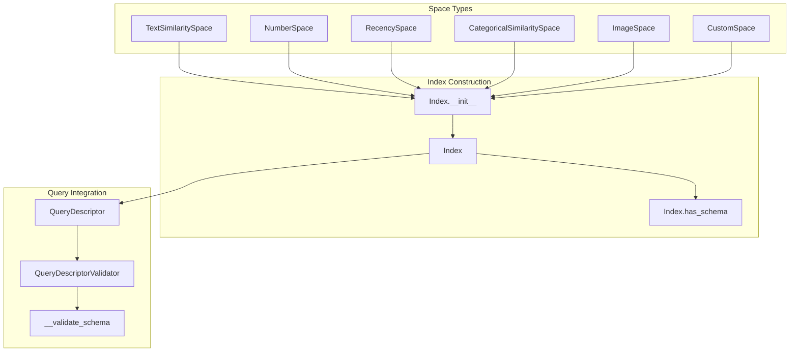
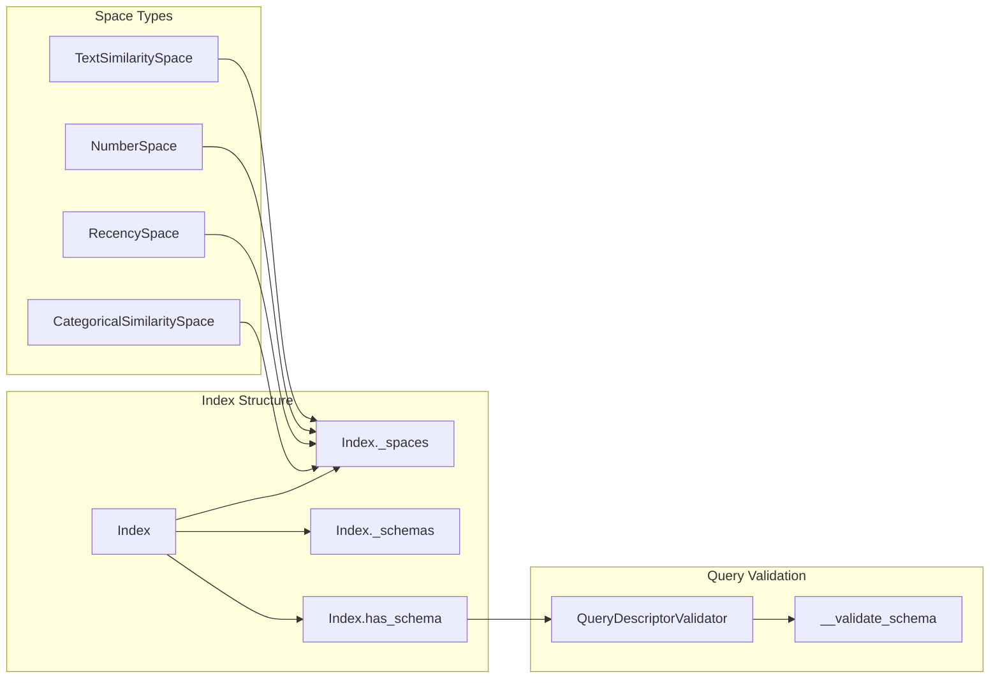

The Index System provides the foundational architecture for organizing and combining multiple vector spaces into unified searchable structures. Indices serve as the bridge between raw data transformations and executable queries, managing space relationships and schema compatibility.

## Core Index Components

<Tabs>
<Tab title="Index Management">
<CardGroup cols={2}>
  <Card 
    title="Index" 
    icon="list-tree" 
    href="/reference/dsl/index/index"
  >
    Core index creation and space combination functionality
  </Card>
  <Card 
    title="Index Meta" 
    icon="tags" 
    href="/reference/dsl/index/index.m"
  >
    Index metadata and configuration management
  </Card>
</CardGroup>
</Tab>

<Tab title="Effects & Processing">
<CardGroup cols={2}>
  <Card 
    title="Effect" 
    icon="sparkles" 
    href="/reference/dsl/index/effect"
  >
    Index effects and transformations
  </Card>
  <Card 
    title="Index Validator" 
    icon="shield-check" 
    href="/reference/dsl/index/index_validator"
  >
    Validation utilities for index components
  </Card>
  <Card 
    title="Utilities" 
    icon="wrench" 
    href="/reference/dsl/index/util/index"
  >
    Index utility functions and helpers
  </Card>
</CardGroup>
</Tab>

<Tab title="Aggregation Components">
<CardGroup cols={2}>
  <Card 
    title="Aggregation Effects" 
    icon="layer-group" 
    href="/reference/dsl/index/util/aggregation_effect_group"
  >
    Group and manage aggregation effects
  </Card>
  <Card 
    title="Event Aggregation Effects" 
    icon="calendar-plus" 
    href="/reference/dsl/index/util/event_aggregation_effect_group"
  >
    Event-specific aggregation effect groups
  </Card>
  <Card 
    title="Aggregation Node Utilities" 
    icon="network-wired" 
    href="/reference/dsl/index/util/aggregation_node_util"
  >
    Utilities for aggregation node management
  </Card>
  <Card 
    title="Event Aggregation Utilities" 
    icon="calendar-clock" 
    href="/reference/dsl/index/util/event_aggregation_node_util"
  >
    Event-specific aggregation utilities
  </Card>
</CardGroup>

<Card 
  title="Effect with Referenced Schema" 
  icon="link" 
  href="/reference/dsl/index/util/effect_with_referenced_schema_object"
>
  Effects with schema object references
</Card>
</Tab>
</Tabs>

## Index Reference

| Component | Purpose | Schema Integration | Space Management |
|-----------|---------|-------------------|------------------|
| `Index._spaces` | Stores constituent spaces | Validates compatibility | Internal space collection |
| `Index._schemas` | Manages schema objects | Schema validation and access | Cross-space schema mapping |
| `Index.has_schema()` | Validates schema compatibility | Used by QueryDescriptorValidator | Boolean schema checking |
| `Index.__init__()` | Index construction | Combines spaces with schemas | Multi-space initialization |

## Index Creation and Space Combination

An `Index` combines multiple `Space` objects into a unified searchable structure through schema compatibility validation and space relationship management. The index maintains references to constituent spaces while ensuring query execution compatibility.



### Index Components

The Index architecture consists of three primary layers that manage space combination, schema validation, and query integration:

| Component | Purpose | Implementation |
|-----------|---------|----------------|
| `Index._spaces` | Stores constituent spaces | Internal space collection with type checking |
| `Index._schemas` | Manages schema objects | Schema validation and cross-reference mapping |
| `Index.has_schema()` | Validates schema compatibility | Boolean schema existence checking for queries |

<AccordionGroup>
<Accordion title="Space Collection and Management">
The Index manages heterogeneous space collections through internal storage mechanisms:

```python
# Basic index construction
index = sl.Index([
    text_space,
    number_space, 
    recency_space,
    categorical_space
])

# Multi-modal index with image and text
multimedia_index = sl.Index([
    description_space,
    image_space,
    category_space,
    price_space
])
```

**Key Features:**
- **Heterogeneous Space Support**: Combines different space types in single index
- **Type Validation**: Ensures space compatibility during construction
- **Schema Mapping**: Maintains relationships between spaces and schema fields
</Accordion>

<Accordion title="Schema Integration and Validation">
Index construction validates schema compatibility across all constituent spaces:

```python
# Schema-aware index construction
class ProductSchema(sl.Schema):
    description: str
    price: float
    category: str
    image_url: str

index = sl.Index([
    sl.TextSimilaritySpace(ProductSchema.description, model="sentence-transformers/all-MiniLM-L6-v2"),
    sl.NumberSpace(ProductSchema.price, mode=sl.Mode.SIMILAR),
    sl.CategoricalSimilaritySpace(ProductSchema.category),
    sl.ImageSpace(ProductSchema.image_url)
])
```

**Validation Process:**
1. **Field Compatibility**: Ensures each space references valid schema fields
2. **Type Checking**: Validates space-field type compatibility
3. **Cross-Reference Validation**: Checks for schema field conflicts
</Accordion>

<Accordion title="Index Metadata and Configuration">
The Index system provides comprehensive metadata management:

```python
# Index with custom metadata
index = sl.Index(
    [text_space, number_space],
    metadata={
        "version": "1.0",
        "description": "Product search index",
        "created": datetime.now()
    }
)

# Schema checking
if index.has_schema(ProductSchema):
    print("Index supports ProductSchema queries")
```

**Metadata Components:**
- **Version Tracking**: Index version management for compatibility
- **Description Fields**: Human-readable index documentation  
- **Schema Registry**: Available schema types for query validation
</Accordion>
</AccordionGroup>

## Index Architecture Patterns

### Multi-Space Index Construction



### Index-Schema Relationship Management

The Index system maintains tight integration with schema objects to ensure query compatibility:

| Relationship Type | Purpose | Implementation |
|------------------|---------|----------------|
| Space-Schema Binding | Links spaces to schema fields | Field reference validation |
| Cross-Space Schema Validation | Ensures schema consistency | Multi-space compatibility checks |
| Query Schema Compatibility | Validates query target schemas | Runtime schema verification |

<Tip>
Indices serve as the central coordination point for multi-space vector operations. Proper index construction ensures optimal query performance and maintains data consistency across heterogeneous space types.
</Tip>

## Advanced Index Features

### Dynamic Index Configuration

Indices support runtime configuration adjustments for different deployment scenarios:

```python
# Production index configuration
production_index = sl.Index([
    text_space,
    number_space
], config={
    "optimization_level": "production",
    "cache_strategy": "aggressive",
    "memory_limit": "8GB"
})

# Development index configuration  
dev_index = sl.Index([
    text_space,
    number_space
], config={
    "optimization_level": "development", 
    "cache_strategy": "minimal",
    "debug_mode": True
})
```

### Index Composition Patterns

| Pattern | Use Case | Benefits |
|---------|----------|----------|
| **Homogeneous Indices** | Single space type across fields | Simplified management, consistent behavior |
| **Heterogeneous Indices** | Multiple space types for rich data | Complex queries, multi-modal search |
| **Hierarchical Indices** | Nested space relationships | Structured data representation |
| **Federated Indices** | Distributed space management | Scalability, fault tolerance |

## Usage Patterns

### Basic Index Creation

```python
# Simple text and number index
basic_index = sl.Index([
    sl.TextSimilaritySpace(schema.description),
    sl.NumberSpace(schema.price, mode=sl.Mode.SIMILAR)
])
```

### Complex Multi-Modal Index

```python
# Advanced multi-modal index
complex_index = sl.Index([
    sl.TextSimilaritySpace(schema.title, model="sentence-transformers/all-MiniLM-L6-v2"),
    sl.TextSimilaritySpace(schema.description, model="sentence-transformers/all-mpnet-base-v2"),
    sl.ImageSpace(schema.image_url, model="clip-ViT-B-32"),
    sl.NumberSpace(schema.price, mode=sl.Mode.SIMILAR),
    sl.RecencySpace(schema.created_at, period_time_list=[
        sl.PeriodTime.DAY,
        sl.PeriodTime.WEEK, 
        sl.PeriodTime.MONTH
    ]),
    sl.CategoricalSimilaritySpace(schema.category)
])
```

### Index Validation and Compatibility

```python
# Schema compatibility checking
if complex_index.has_schema(ProductSchema):
    # Index supports ProductSchema queries
    query = sl.Query(complex_index).find(ProductSchema)
else:
    raise InvalidInputException("Index does not support ProductSchema")
```

The Index system forms the foundation of Superlinked's search architecture, providing the organizational structure needed for complex vector operations while maintaining schema compatibility and type safety across heterogeneous space collections. 