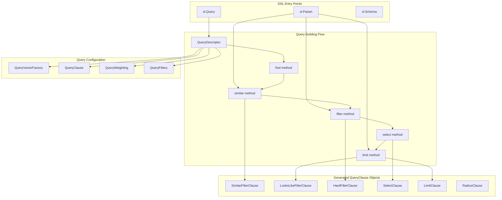
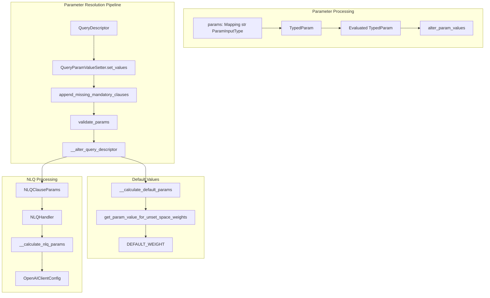
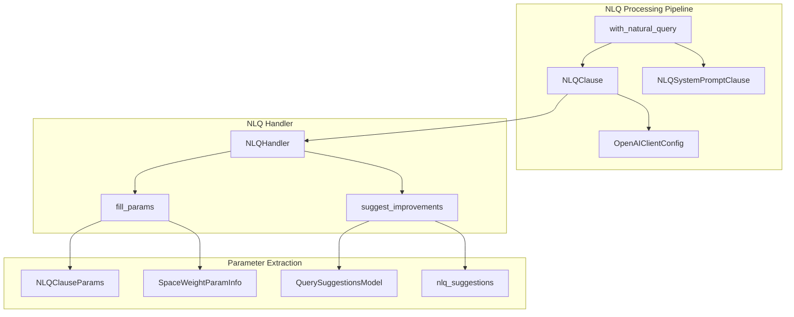
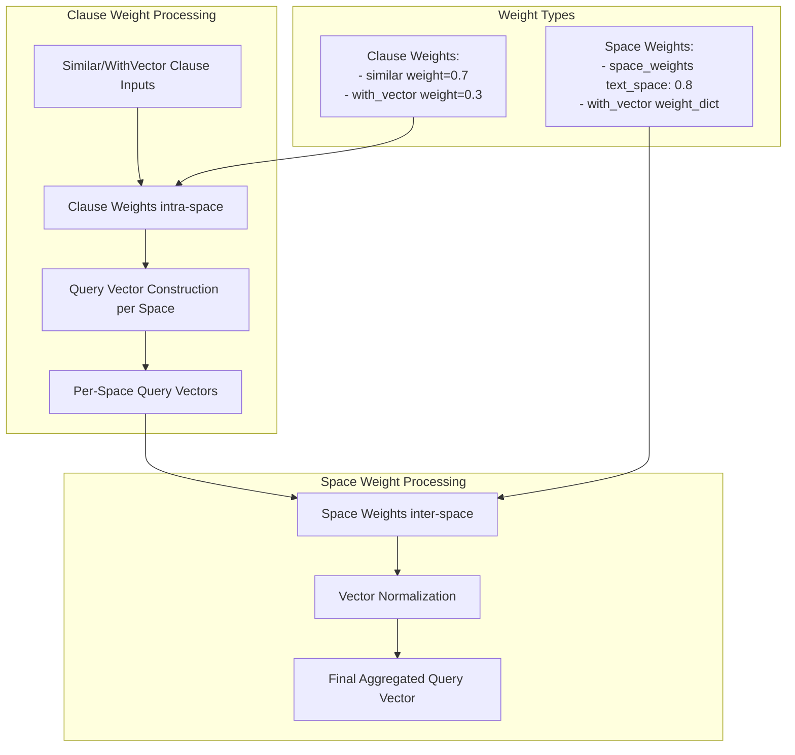
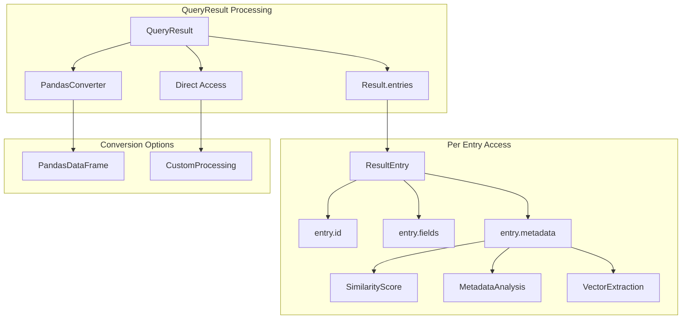

The Query System provides a powerful and flexible framework for defining, executing, and processing vector searches across multi-space indices. It supports dynamic parameter binding, natural language processing, advanced filtering operations, and comprehensive result management with metadata.

## Core Query Architecture

<Tabs>
<Tab title="Query Construction">
<CardGroup cols={2}>
  <Card 
    title="Query" 
    icon="magnifying-glass" 
    href="/reference/dsl/query/query"
  >
    Core query definition and execution functionality
  </Card>
  <Card 
    title="Query Descriptor" 
    icon="file-text" 
    href="/reference/dsl/query/query_descriptor"
  >
    Query metadata and configuration descriptors
  </Card>
  <Card 
    title="Query Vector Factory" 
    icon="industry" 
    href="/reference/dsl/query/query_vector_factory"
  >
    Factory for creating and managing query vectors
  </Card>
  <Card 
    title="Query Clause" 
    icon="list-check" 
    href="/reference/dsl/query/query_clause"
  >
    Individual query clause definitions and operations
  </Card>
</CardGroup>
</Tab>

<Tab title="Parameter Management">
<CardGroup cols={2}>
  <Card 
    title="Parameters" 
    icon="sliders" 
    href="/reference/dsl/query/param"
  >
    Query parameter definitions and management
  </Card>
  <Card 
    title="Typed Parameters" 
    icon="check-double" 
    href="/reference/dsl/query/typed_param"
  >
    Strongly-typed parameter handling
  </Card>
  <Card 
    title="Clause Parameters" 
    icon="gear" 
    href="/reference/dsl/query/clause_params"
  >
    Parameters specific to query clauses
  </Card>
  <Card 
    title="Parameter Evaluator" 
    icon="calculator" 
    href="/reference/dsl/query/param_evaluator"
  >
    Parameter evaluation and processing
  </Card>
</CardGroup>
</Tab>

<Tab title="Natural Language Processing">
<CardGroup cols={2}>
  <Card 
    title="NLQ Handler" 
    icon="comments" 
    href="/reference/dsl/query/nlq/nlq_handler"
  >
    Natural language query processing and handling
  </Card>
  <Card 
    title="NLQ Parameter Handler" 
    icon="wand-magic-sparkles" 
    href="/reference/dsl/query/natural_language_query_param_handler"
  >
    Parameter handling for natural language queries
  </Card>
  <Card 
    title="NLQ Suggestions" 
    icon="lightbulb" 
    href="/reference/dsl/query/nlq/suggestion/query_suggestion_model"
  >
    Query suggestion generation and management
  </Card>
  <Card 
    title="Parameter Filling" 
    icon="fill" 
    href="/reference/dsl/query/nlq/param_filler/index"
  >
    Automatic parameter filling for NLQ
  </Card>
</CardGroup>
</Tab>

<Tab title="Query Clauses">
<CardGroup cols={3}>
  <Card 
    title="Hard Filter" 
    icon="filter" 
    href="/reference/dsl/query/query_clause/hard_filter_clause"
  >
    Exact filtering with hard constraints
  </Card>
  <Card 
    title="Looks Like Filter" 
    icon="eye" 
    href="/reference/dsl/query/query_clause/looks_like_filter_clause"
  >
    Similarity-based filtering
  </Card>
  <Card 
    title="Similar Filter" 
    icon="copy" 
    href="/reference/dsl/query/query_clause/similar_filter_clause"
  >
    Semantic similarity filtering
  </Card>
  <Card 
    title="Radius Clause" 
    icon="circle" 
    href="/reference/dsl/query/query_clause/radius_clause"
  >
    Distance-based filtering
  </Card>
  <Card 
    title="Limit Clause" 
    icon="list-ol" 
    href="/reference/dsl/query/query_clause/limit_clause"
  >
    Result count limitation
  </Card>
  <Card 
    title="Weight by Space" 
    icon="balance-scale" 
    href="/reference/dsl/query/query_clause/weight_by_space_clause"
  >
    Space-based result weighting
  </Card>
</CardGroup>
</Tab>

<Tab title="Result Processing">
<CardGroup cols={2}>
  <Card 
    title="Query Mixin" 
    icon="puzzle-piece" 
    href="/reference/dsl/query/query_mixin"
  >
    Composable query functionality
  </Card>
  <Card 
    title="Query Weighting" 
    icon="weight-hanging" 
    href="/reference/dsl/query/query_weighting"
  >
    Result weighting and scoring
  </Card>
  <Card 
    title="Query Filters" 
    icon="funnel" 
    href="/reference/dsl/query/query_filters"
  >
    Filter management and application
  </Card>
  <Card 
    title="Result Converters" 
    icon="right-left" 
    href="/reference/dsl/query/query_result_converter/index"
  >
    Query result conversion and formatting
  </Card>
</CardGroup>
</Tab>
</Tabs>

## Query System Reference

| Component | Purpose | Key Methods | Usage |
|-----------|---------|-------------|-------|
| `QueryDescriptor` | Query construction via fluent API | `find()`, `similar()`, `filter()`, `select()`, `limit()` | Method chaining for query building |
| `SimilarFilterClause` | User input similarity search | `from_param()`, `evaluate()` | Text queries, user inputs |
| `LooksLikeFilterClause` | Item-based similarity search | `from_param()`, `evaluate()` | Item-to-item recommendations |
| `HardFilterClause` | Exact field filtering | `from_param()`, `evaluate()` | Precise constraint application |
| `QueryParamValueSetter` | Parameter resolution pipeline | `set_values()`, `validate_params()` | Runtime parameter binding |
| `NLQHandler` | Natural language processing | `fill_params()`, `suggest_improvements()` | Natural language query support |

## Query Building and Parameter System

The `QueryDescriptor` class provides a fluent API for building complex search operations with dynamic parameters. Queries are constructed through method chaining, where each method adds a specific `QueryClause` to the descriptor.



### Core Query Methods

The system provides two primary search methods that can be combined and weighted:

| Method | Purpose | Parameters | Usage |
|--------|---------|------------|-------|
| `similar()` | Search using user-provided input | `space`, `param`, `weight` | Text queries, user inputs |
| `with_vector()` | Search using stored item vectors | `schema`, `id_param`, `weight` | Item-to-item recommendations |

<AccordionGroup>
<Accordion title="Similar Clause Usage">
The `.similar()` method transforms user input into query vectors through the specified space:

```python
# Basic similarity search
query = sl.Query(paragraph_index).find(paragraph).similar(
    relevance_space, 
    sl.Param("query_text")
).select_all()

# Weighted multi-space similarity
movies_query = (
    sl.Query(movie_index, weights={
        description_space: sl.Param("description_weight"),
        genre_space: sl.Param("genre_weight"), 
        recency_space: sl.Param("recency_weight")
    })
    .find(movie_schema)
    .similar(description_space, sl.Param("description_query"))
    .similar(genre_space, sl.Param("genre_query"))
    .select_all()
    .limit(sl.Param("limit"))
)
```

**Key Features:**
- **Multi-Space Support**: Search across multiple vector spaces simultaneously
- **Dynamic Weighting**: Runtime adjustment of space importance
- **Parameter Binding**: Flexible query parameterization for reuse
</Accordion>

<Accordion title="With Vector Clause Usage">
The `.with_vector()` method uses existing item vectors for search:

```python
# Item-to-item recommendations
user_query = (
    sl.Query(product_index)
    .find(product_schema)
    .with_vector(product_schema, sl.Param("product_id"))
    .select_all()
    .limit(sl.Param("limit"))
)

# Per-space weighting for with_vector
weight_dict = {text_space: 0.8, category_space: 0.2}
query = sl.Query(index).find(schema).with_vector(
    schema, 
    "item_id", 
    weight_dict
).select_all()
```

**Implementation Features:**
- **Vector Reuse**: Leverages pre-computed item embeddings
- **Space-Specific Weights**: Fine-grained control over space contributions
- **Efficient Recommendations**: Optimized for item-based similarity
</Accordion>

<Accordion title="Parameter System Implementation">
The `Param` class enables dynamic query construction with runtime value binding:

| Component | Purpose | Implementation |
|-----------|---------|----------------|
| `sl.Param("name")` | Parameter placeholder | Runtime value substitution |
| `param.default` | Fallback value | Used when no runtime value provided |
| `param.description` | NLQ context | Enables natural language processing |
| `param.options` | Allowed values | Constrains parameter inputs |

```python
# Advanced parameter configuration
price_param = sl.Param(
    "max_price",
    default=1000.0,
    description="Maximum price filter for products",
    options=[100, 500, 1000, 2000]
)

category_param = sl.Param(
    "category_filter",
    description="Product category to search within",
    options=["electronics", "clothing", "books"]
)
```
</Accordion>
</AccordionGroup>

## Query Execution and Parameter Processing

Query execution involves parameter resolution through the `QueryParamValueSetter` class, which handles parameter binding, NLQ processing, and clause evaluation.



### Parameter Resolution Process

The `QueryParamValueSetter` coordinates the complete parameter resolution pipeline:

| Stage | Purpose | Implementation |
|-------|---------|----------------|
| `append_missing_mandatory_clauses()` | Adds required clauses | `LimitClause`, `RadiusClause`, `SelectClause` |
| `validate_params()` | Validates parameter names | Checks against clause parameters |
| `__alter_query_descriptor()` | Applies parameter values | Updates clause parameters |
| `__calculate_nlq_params()` | Processes NLQ parameters | Calls `NLQHandler.fill_params()` |
| `__calculate_default_params()` | Sets default values | Uses `Param.default` values |

<AccordionGroup>
<Accordion title="Query Clause Implementation">
Each query method generates specific `QueryClause` objects:

| Clause Type | Generated By | Key Methods | Purpose |
|-------------|--------------|-------------|---------|
| `SimilarFilterClause` | `similar()` | `from_param()`, `evaluate()` | Vector similarity search |
| `LooksLikeFilterClause` | `with_vector()` | `from_param()`, `evaluate()` | Item-based search |
| `HardFilterClause` | `filter()` | `from_param()`, `evaluate()` | Exact field filtering |
| `SelectClause` | `select()` | `from_param()`, `evaluate()` | Field selection |
| `LimitClause` | `limit()` | `from_param()`, `get_value()` | Result count limit |
| `RadiusClause` | `radius()` | `from_param()`, `get_value()` | Distance constraint |

```python
# Clause evaluation example
similar_clause = SimilarFilterClause(
    space=text_space,
    param=sl.Param("query_text"),
    weight=0.8
)

# Runtime evaluation
evaluated_clause = similar_clause.evaluate({"query_text": "search term"})
```
</Accordion>

<Accordion title="Clause Evaluation Process">
Each `QueryClause` implements parameter evaluation through key methods:

| Method | Purpose | Return Type |
|--------|---------|-------------|
| `evaluate()` | Converts clause to executable form | Clause-specific type |
| `alter_param_values()` | Updates parameter values | Modified clause instance |
| `get_param_value_by_param_name()` | Retrieves parameter values | `dict[str, PythonTypes]` |

```python
# Dynamic parameter evaluation
clause_params = {
    "query_text": "machine learning",
    "max_price": 1000.0,
    "category": "books"
}

# Evaluate all clauses with parameters
evaluated_clauses = [
    clause.evaluate(clause_params) 
    for clause in query_descriptor.clauses
]
```
</Accordion>
</AccordionGroup>

## Advanced Query Features

### Natural Language Query Processing

The system supports natural language query processing through the `NLQClause` and `NLQHandler` classes, which integrate with OpenAI for automated parameter extraction from natural language queries.



### Hard Filtering and Comparison Operations

The query system implements hard filtering through `HardFilterClause` with comprehensive comparison operation support:

| Operation Type | Implementation | Usage Example |
|---------------|----------------|---------------|
| Equality | `ComparisonOperation.EQUAL` | `schema.field == "value"` |
| Inequality | `ComparisonOperation.NOT_EQUAL` | `schema.field != "value"` |
| Numeric comparison | `ComparisonOperation.GREATER_THAN` | `schema.price > 100` |
| List operations | `ComparisonOperation.CONTAINS` | `schema.categories.contains(["tag"])` |
| Combined filters | `_Or[SchemaField]` | `(field == "a") | (field == "b")` |

<AccordionGroup>
<Accordion title="Query Weighting System">
The system implements two distinct weighting mechanisms that control different aspects of similarity calculation:



**Space Weights vs Clause Weights:**

| Component | Purpose | Implementation |
|-----------|---------|----------------|
| **Space Weights** | Inter-space importance control | Reweights normalized per-space vectors |
| **Clause Weights** | Intra-space clause contribution | Controls query vector construction within spaces |

**Weight Processing Order:**
1. **Clause weights** influence query vector construction per space
2. Per-space query vectors are normalized
3. **Space weights** reweight normalized vectors for final aggregation
4. Final similarity scores computed against aggregated query vector
</Accordion>

<Accordion title="Query Validation and Error Handling">
The system implements comprehensive validation through multiple validator classes:

| Validator | Purpose | Key Methods |
|-----------|---------|-------------|
| `QueryDescriptorValidator` | Query structure validation | `validate()`, `__validate_schema()` |
| `QueryFilterValidator` | Filter operation validation | `validate_operation_is_supported()` |
| `QueryFilterValidator` | Parameter type validation | `validate_operation_operand_type()` |

```python
# Query validation example
try:
    query = (
        sl.Query(index)
        .find(schema)
        .similar(text_space, sl.Param("query"))
        .filter(schema.price > sl.Param("max_price"))
        .limit(10)
    )
    
    # Validation occurs during query construction
    validated_query = QueryDescriptorValidator().validate(query)
    
except QueryValidationError as e:
    print(f"Query validation failed: {e}")
```
</Accordion>
</AccordionGroup>

## Result Structure and Metadata

Query results are structured through the `QueryResult` class and related result classes that provide comprehensive search result information and metadata.

```mermaid
flowchart TD
    subgraph ResultClassHierarchy["Result Class Hierarchy"]
        QR[QueryResult]
        RE[ResultEntry]
        RM[ResultMetadata]
        REM[ResultEntryMetadata]
    end
    
    subgraph QueryResultStructure["QueryResult Structure"]
        QRE[entries: Sequence ResultEntry]
        QRM[metadata: ResultMetadata]
        QRS[__str__ method]
    end
    
    subgraph ResultEntryStructure["ResultEntry Structure"]
        REI[id: str]
        REF[fields: dict str Any]
        REMT[metadata: ResultEntryMetadata]
    end
    
    subgraph ResultMetadataStructure["ResultMetadata Structure"]
        RMS[schema_name: str | None]
        RMSV[search_vector: Sequence float]
        RMSP[search_params: dict str Any]
    end
    
    subgraph ResultEntryMetadataStructure["ResultEntryMetadata Structure"]
        REMS[score: float]
        REMPS[partial_scores: Sequence float]
        REMVP[vector_parts: Sequence Sequence float]
    end
    
    QR --> QRE
    QR --> QRM
    QR --> QRS
    
    QRE --> RE
    RE --> REI
    RE --> REF
    RE --> REMT
    
    REMT --> REM
    QRM --> RM
    
    RM --> RMS
    RM --> RMSV
    RM --> RMSP
    
    REM --> REMS
    REM --> REMPS
    REM --> REMVP
```

### Result Classes Implementation

The result system implements structured data through `ImmutableBaseModel` classes:

| Class | Purpose | Key Fields |
|-------|---------|------------|
| `QueryResult` | Top-level result container | `entries`, `metadata`, `__str__()` |
| `ResultEntry` | Individual search result | `id`, `fields`, `metadata` |
| `ResultEntryMetadata` | Per-result metadata | `score`, `partial_scores`, `vector_parts` |
| `ResultMetadata` | Query-level metadata | `schema_name`, `search_vector`, `search_params` |

<AccordionGroup>
<Accordion title="Metadata Access and Processing">
The system provides metadata access through the `include_metadata()` method:

| Component | Purpose | Implementation |
|-----------|---------|----------------|
| `include_metadata()` | Enables metadata collection | Sets `QueryUserConfig.with_metadata = True` |
| `QueryUserConfig` | Query execution configuration | Controls metadata inclusion |
| `with_metadata` property | Metadata inclusion flag | Used by query execution pipeline |

```python
# Enable metadata collection
query_with_metadata = (
    sl.Query(index)
    .find(schema)
    .similar(text_space, sl.Param("query"))
    .include_metadata()
    .limit(10)
)

# Access result metadata
result = app.query(query_with_metadata, query="machine learning")
for entry in result.entries:
    print(f"Score: {entry.metadata.score}")
    print(f"Partial scores: {entry.metadata.partial_scores}")
```
</Accordion>

<Accordion title="Result Processing and Conversion">
The system provides multiple ways to process and analyze query results:



**Result Access Patterns:**

```python
# Direct result access
result = app.query(query, **params)
for entry in result.entries:
    print(f"ID: {entry.id}")
    print(f"Fields: {entry.fields}")
    if entry.metadata:
        print(f"Score: {entry.metadata.score}")

# Pandas conversion
import pandas as pd
df = sl.PandasConverter.to_pandas(result)
print(df[['id', 'title', 'score']].head())

# Custom result processing
scores = [entry.metadata.score for entry in result.entries if entry.metadata]
avg_score = sum(scores) / len(scores)
```
</Accordion>
</AccordionGroup>

## Usage Patterns

### Basic Query Construction

```python
# Simple semantic search
query = (
    sl.Query(index)
    .find(schema)
    .similar(text_space, sl.Param("query_text"))
    .limit(10)
)
```

### Advanced Multi-Space Query

```python
# Complex query with filtering and weighting
advanced_query = (
    sl.Query(index, weights={
        text_space: sl.Param("text_weight"),
        number_space: sl.Param("number_weight")
    })
    .find(schema)
    .similar(text_space, sl.Param("query_text"))
    .filter(schema.price <= sl.Param("max_price"))
    .filter(schema.category == sl.Param("category"))
    .with_vector(schema, sl.Param("similar_item_id"), weight=0.3)
    .select(schema.title, schema.description, schema.price)
    .limit(sl.Param("limit"))
    .include_metadata()
)
```

### Natural Language Query

```python
# Natural language query processing
nlq_query = (
    sl.Query(index)
    .find(schema)
    .with_natural_query(
        "Find affordable electronics under $500 similar to smartphones",
        nlq_config={"model": "gpt-4", "temperature": 0.1}
    )
    .limit(20)
)
```

<Tip>
The Query module supports both programmatic and natural language queries, making it accessible to both developers and end-users while maintaining powerful customization capabilities through comprehensive parameter systems and advanced filtering options.
</Tip>

The Query System provides the complete framework for building, executing, and processing complex vector searches with comprehensive support for dynamic parameters, natural language processing, advanced filtering, and structured result management. 