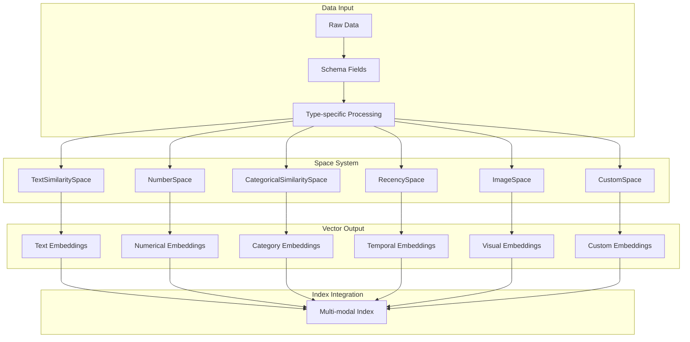
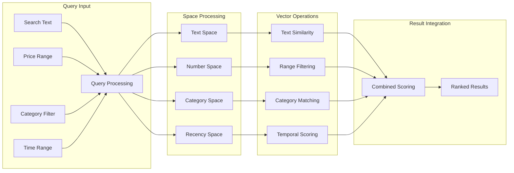

The Space System provides the foundation for creating vector embeddings from different data types, offering specialized space implementations for text, images, categorical data, numbers, and temporal information. Spaces define how raw data is transformed into vector representations that enable semantic similarity calculations and multi-modal search.

For information about how spaces integrate with data schemas, see [Schema System](/reference/common/schema/overview). For index creation and querying, see [Index and Query System](/reference/dsl/index/overview).

## Space Type Reference

| Space Type | Data Input | Primary Use Case | Key Parameters |
|------------|------------|------------------|----------------|
| `TextSimilaritySpace` | Text strings | Semantic text similarity | `model`, `chunking_method` |
| `NumberSpace` | Numerical values | Range-based similarity | `min_value`, `max_value`, `mode` |
| `CategoricalSimilaritySpace` | Category labels | Discrete category matching | `categories`, `uncategorized_as_category` |
| `RecencySpace` | Timestamps | Time-based relevance | `period_time_list`, `negative_filter` |
| `ImageSpace` | Image data | Visual similarity | `model`, `image_size` |
| `CustomSpace` | Any data type | Specialized embeddings | Custom `encoder` function |

## Space Components Reference

<Tabs>
<Tab title="Core Components">
Foundation components for vector space definition:

<CardGroup cols={2}>
  <Card 
    title="Space" 
    icon="cube" 
    href="/reference/dsl/space/space"
  >
    Base space class and core functionality
  </Card>
  <Card 
    title="Space Field Set" 
    icon="layer-group" 
    href="/reference/dsl/space/space_field_set"
  >
    Field set definitions for space configurations
  </Card>
  <Card 
    title="Custom Space" 
    icon="wrench" 
    href="/reference/dsl/space/custom_space"
  >
    Custom space implementations for specialized use cases
  </Card>
  <Card 
    title="Exception" 
    icon="triangle-exclamation" 
    href="/reference/dsl/space/exception"
  >
    Exception handling for space operations
  </Card>
</CardGroup>
</Tab>

<Tab title="Embedding Space Types">
Specialized spaces for different data types:

<CardGroup cols={2}>
  <Card 
    title="Text Similarity Space" 
    icon="file-text" 
    href="/reference/dsl/space/text_similarity_space"
  >
    Semantic text embeddings for natural language processing
  </Card>
  <Card 
    title="Image Space" 
    icon="image" 
    href="/reference/dsl/space/image_space"
  >
    Visual embeddings for image similarity and search
  </Card>
  <Card 
    title="Categorical Similarity Space" 
    icon="tags" 
    href="/reference/dsl/space/categorical_similarity_space"
  >
    Embeddings for categorical and discrete data
  </Card>
  <Card 
    title="Number Space" 
    icon="calculator" 
    href="/reference/dsl/space/number_space"
  >
    Numerical embeddings for quantitative data
  </Card>
  <Card 
    title="Recency Space" 
    icon="clock" 
    href="/reference/dsl/space/recency_space"
  >
    Time-based embeddings for temporal relevance
  </Card>
  <Card 
    title="Image Space Field Set" 
    icon="images" 
    href="/reference/dsl/space/image_space_field_set"
  >
    Specialized field sets for image space configurations
  </Card>
</CardGroup>
</Tab>

<Tab title="Advanced Features">
Additional space functionality and configurations:

<CardGroup cols={2}>
  <Card 
    title="Input Aggregation Mode" 
    icon="compress" 
    href="/reference/dsl/space/input_aggregation_mode"
  >
    Aggregation strategies for multi-value inputs
  </Card>
  <Card 
    title="Has Space Field Set" 
    icon="check-circle" 
    href="/reference/dsl/space/has_space_field_set"
  >
    Interface for space field set management
  </Card>
</CardGroup>
</Tab>
</Tabs>


## Space Implementation Guide

<AccordionGroup>
<Accordion title="Space Definition and Usage">
Spaces are instantiated with schema field references and configuration parameters to create embeddings for specific data types.

### Basic Space Configuration

```python
import superlinked as sl

# Define schema
@sl.schema
class ProductSchema:
    description: sl.String
    price: sl.Float
    category: sl.String
    created_at: sl.Timestamp
    id: sl.IdField

product = ProductSchema()

# Create spaces for different data types
text_space = sl.TextSimilaritySpace(
    text=product.description,
    model="sentence-transformers/all-mpnet-base-v2"
)

number_space = sl.NumberSpace(
    number=product.price,
    min_value=0.0,
    max_value=1000.0
)

category_space = sl.CategoricalSimilaritySpace(
    category_input=product.category,
    categories=["electronics", "clothing", "books"]
)

recency_space = sl.RecencySpace(
    timestamp=product.created_at,
    period_time_list=[
        sl.PeriodTime(timedelta(days=1)),
        sl.PeriodTime(timedelta(days=7)),
        sl.PeriodTime(timedelta(days=30))
    ]
)
```

**Space Architecture Flow**


</Accordion>

<Accordion title="Advanced Space Configuration">


```python
# Multi-language text space
text_space = sl.TextSimilaritySpace(
    text=product.description,
    model="sentence-transformers/paraphrase-multilingual-MiniLM-L12-v2",
    chunking_method=sl.TextChunkingMethod.WORD,
    chunk_size=100,
    chunk_overlap=20
)

# Similarity-based number space
price_space = sl.NumberSpace(
    number=product.price,
    min_value=0.0,
    max_value=1000.0,
    mode=sl.Mode.SIMILAR
)

# Dynamic recency with multiple periods
recency_space = sl.RecencySpace(
    timestamp=product.created_at,
    period_time_list=[
        sl.PeriodTime(timedelta(hours=1)),   # Recent items
        sl.PeriodTime(timedelta(days=1)),    # Daily relevance  
        sl.PeriodTime(timedelta(days=7)),    # Weekly trends
        sl.PeriodTime(timedelta(days=30))    # Monthly patterns
    ],
    negative_filter=timedelta(days=90)  # Exclude very old items
)

# Custom space with preprocessing
custom_space = sl.CustomSpace(
    input_=product.description,
    encoder=lambda text: custom_embedding_function(text),
    dimension=512
)
```
</Accordion>

<Accordion title="Multi-Modal Space Combination">

Spaces can be combined within indices to create rich, multi-dimensional embeddings that capture different aspects of your data.

### Index Integration

```python
# Combine multiple spaces in an index
index = sl.Index([text_space, number_space, category_space, recency_space])

# Create query with multi-space filtering
query = (
    sl.Query(index)
    .find(product)
    .similar(text_space.text, param="search_text")
    .filter(number_space.number < param("max_price"))
    .filter(category_space.category_input == param("target_category"))
    .filter(recency_space.timestamp > param("since_date"))
    .limit(10)
)

# Execute with parameters
results = executor.query(
    query,
    search_text="wireless headphones",
    max_price=200.0,
    target_category="electronics", 
    since_date=datetime.now() - timedelta(days=30)
)
```

**Multi-Modal Query Flow**


</Accordion>

<Accordion title="Space Field Sets and Configuration">

Advanced space configurations use field sets to define complex input patterns and aggregation strategies.

### Field Set Configuration

```python
# Image space with field set
image_field_set = sl.ImageSpaceFieldSet(
    image_data=product.image,
    metadata=product.description
)

image_space = sl.ImageSpace(
    image=image_field_set,
    model="clip-vit-base-patch32"
)

# Text space with aggregation
text_field_set = sl.SpaceFieldSet(
    text=product.description,
    aggregation_mode=sl.InputAggregationMode.MEAN
)

# Custom space with complex field mapping
custom_field_set = sl.SpaceFieldSet(
    primary_field=product.description,
    secondary_field=product.category,
    aggregation_mode=sl.InputAggregationMode.CONCATENATE
)
```
</Accordion>

<Accordion title="Integration with Framework Components">

Spaces integrate seamlessly with other Superlinked components to create complete vector search systems.

### Parser and Source Integration

```python
# Schema and parser setup
parser = sl.DataFrameParser(
    product,
    mapping={
        product.id: "product_id",
        product.description: "description_text",
        product.price: "price_value",
        product.category: "category_name",
        product.created_at: "timestamp"
    }
)

# Source configuration  
source = sl.InMemorySource(product, parser=parser)

# Application setup with spaces
app = sl.InMemoryApp(
    vector_database=sl.InMemoryVectorDatabase(),
    indices=[index],
    sources=[source]
)
```
</Accordion>
</AccordionGroup>

## Key Features

Space components provide:

- **Multi-Modal Support**: Handle text, images, numbers, categories, and time data
- **Semantic Similarity**: Advanced similarity calculations for each data type
- **Flexible Configuration**: Customizable space parameters for optimal performance
- **Aggregation Strategies**: Multiple ways to handle multi-value inputs
- **Custom Implementations**: Extensible architecture for specialized embeddings

<Info>
Spaces define how different types of data are transformed into vector representations. Each space type is optimized for specific data characteristics and similarity calculations.
</Info>


## Vector Space Concepts

Spaces handle:

1. **Data Transformation**: Convert raw data into vector representations
2. **Similarity Calculation**: Define how similarity is measured in the vector space
3. **Dimensionality**: Control the size and complexity of embeddings
4. **Aggregation**: Combine multiple values into single embeddings
5. **Normalization**: Ensure vectors are properly scaled for comparison
6. **Model Integration**: Interface with pre-trained models and custom encoders 