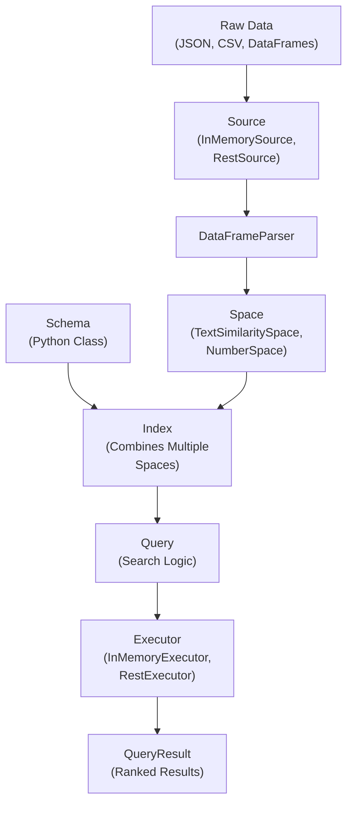

Superlinked's framework is organized into two main modules that work together to provide a complete vector computation and data processing solution.

## Framework Architecture

### Common Module

Contains foundational components for data parsing and schema definition:

<CardGroup cols={3}>
  <Card title="DAG" icon="sitemap" href="/reference/common/dag/period_time">
    Time-based data processing and period management
  </Card>
  <Card
    title="Parser"
    icon="file-code"
    href="/reference/common/parser/data_parser"
  >
    Data parsing utilities for various input formats
  </Card>
  <Card title="Schema" icon="database" href="/reference/common/schema/schema">
    Schema definition and validation components
  </Card>
</CardGroup>

### DSL Module

Contains the domain-specific language components for vector computation:

<CardGroup cols={4}>
  <Card title="App" icon="rocket" href="/reference/dsl/app">
    Application framework and execution context
  </Card>
  <Card title="Executor" icon="cogs" href="/reference/dsl/executor">
    Execution engines for different deployment modes
  </Card>
  <Card title="Index" icon="list" href="/reference/dsl/index">
    Vector indexing and organization
  </Card>
  <Card title="Query" icon="magnifying-glass" href="/reference/dsl/query">
    Query processing and natural language interfaces
  </Card>
</CardGroup>

<CardGroup cols={4}>
  <Card title="Registry" icon="folder-open" href="/reference/dsl/registry">
    Component registration and discovery
  </Card>
  <Card
    title="Source"
    icon="arrow-right-to-bracket"
    href="/reference/dsl/source"
  >
    Data source connectors and interfaces
  </Card>
  <Card title="Space" icon="cube" href="/reference/dsl/space">
    Vector space definitions and transformations
  </Card>
  <Card title="Storage" icon="hard-drive" href="/reference/dsl/storage">
    Vector database integrations
  </Card>
</CardGroup>

## Getting Started

<Note>
  For a high-level understanding of these concepts and how they work together,
  visit the [concepts overview](/concepts/overview) section.
</Note>

<Info>
  Browse all available components and their detailed API documentation in the
  [components](/reference/components) section.
</Info>

## Quick Navigation

Use the sidebar navigation to explore specific modules, or jump directly to commonly used components:

- **Schema Definition**: Start with [Schema](/reference/common/schema/schema) to define your data structure
- **Vector Spaces**: Explore [Space](/reference/dsl/space) for embedding and similarity configurations
- **Indexing**: Learn about [Index](/reference/dsl/index) for organizing your vector data
- **Querying**: Check [Query](/reference/dsl/query) for search and retrieval operations
